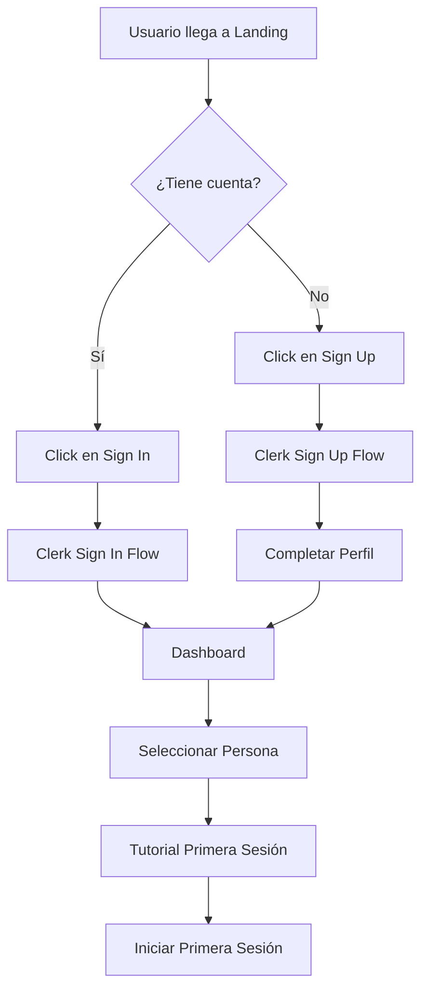
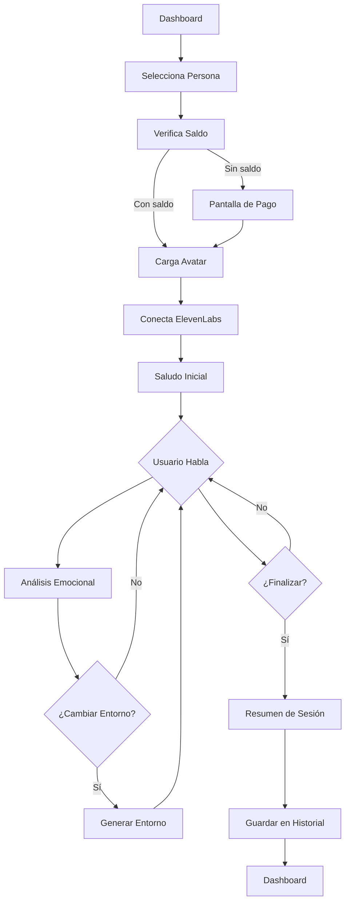
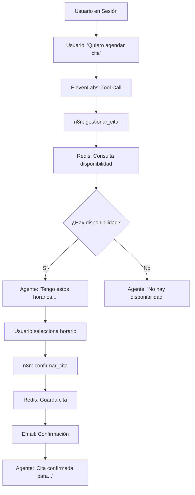
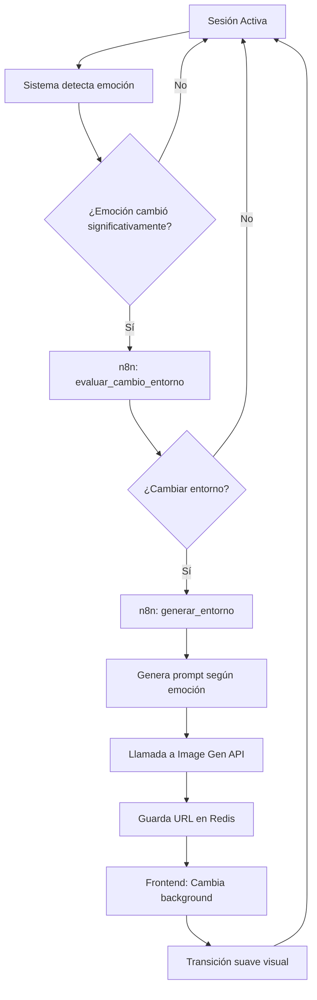
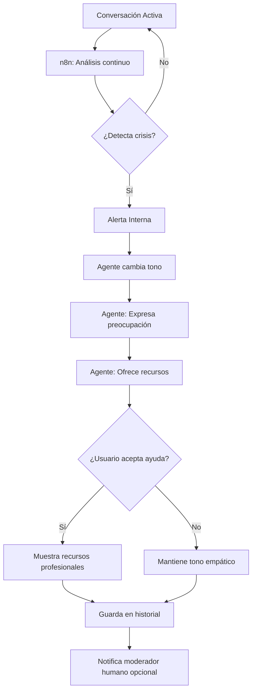
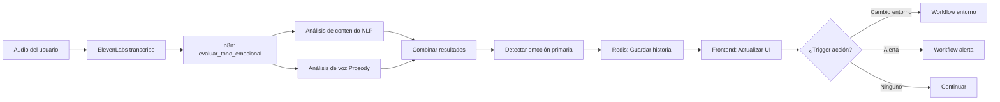
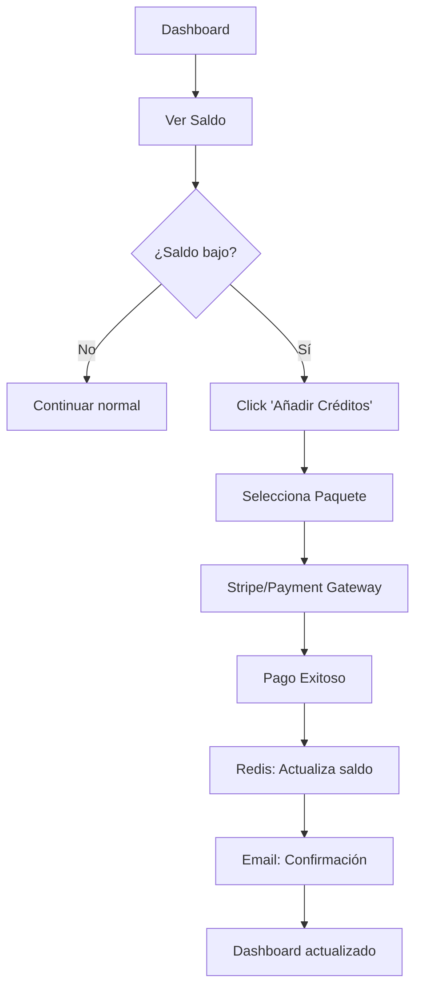

# Flujos de Usuario - Psyness

## 1. Flujo de Onboarding

### Primera Visita



**Pasos**:
1. Usuario ve landing page
2. Se registra/inicia sesión con Clerk
3. Completa perfil básico (opcional)
4. Ve dashboard con 3 opciones de persona
5. Tutorial rápido (opcional, skip disponible)
6. Inicia primera sesión

---

## 2. Flujo de Sesión Normal

### Sesión Completa



**Detalles**:
1. **Selección**: Usuario elige zen/profesional/amigo
2. **Verificación**: Sistema verifica créditos/saldo
3. **Carga**: Avatar de Anam se inicializa (3-5s)
4. **Conexión**: WebSocket con ElevenLabs establece
5. **Inicio**: Agente saluda según personalidad
6. **Conversación**: Flujo libre de diálogo
7. **Análisis**: n8n analiza tono cada ~30s
8. **Entorno**: Cambia background según emoción
9. **Cierre**: Usuario finaliza o tiempo límite
10. **Resumen**: Muestra duración, emociones, insights

---

## 3. Flujo de Gestión de Citas

### Agendar Nueva Cita



**Variantes**:
- **Modificar cita**: Similar pero consulta cita existente
- **Cancelar cita**: Validación + eliminación + email
- **Consultar citas**: Lista de próximas citas

---

## 4. Flujo de Cambio de Entorno

### Generación Dinámica



**Triggers para cambio**:
- Ansiedad → Calma (playa, naturaleza)
- Tristeza → Esperanza (amanecer, flores)
- Estrés → Orden (espacios limpios)
- Manual (usuario pide cambio)

---

## 5. Flujo de Escalamiento (Crisis)

### Detección de Crisis



**Criterios de crisis**:
- Mención de autolesión
- Ideación suicida
- Lenguaje de desesperanza extrema
- Escalada emocional rápida

---

## 6. Flujo de Análisis Emocional

### Background Process



**Frecuencia**: Cada 30 segundos de conversación activa

---

## 7. Flujo de Historial

### Ver Sesiones Pasadas

```
Dashboard → Ver Historial → Lista de Sesiones
                              ↓
                     Selecciona Sesión
                              ↓
                   ┌──────────┴──────────┐
                   ↓                     ↓
            Detalles Básicos      Gráfico Emocional
            - Fecha/hora          - Timeline de emociones
            - Duración            - Picos/valles
            - Persona             - Promedio general
            - Costo                      ↓
                                 Insights Generados
                                 - Patrones detectados
                                 - Recomendaciones
```

---

## 8. Flujo de Pago/Créditos

### Compra de Créditos



**Paquetes** (ejemplo):
- Básico: 3 sesiones (30min c/u)
- Estándar: 10 sesiones
- Premium: Ilimitado mensual

---

## TODO

- [ ] Crear prototipos visuales de cada flujo
- [ ] Definir tiempos exactos de cada paso
- [ ] Añadir casos de error en cada flujo
- [ ] Documentar fallbacks
- [ ] Crear user journey maps
- [ ] Testear flujos con usuarios reales
