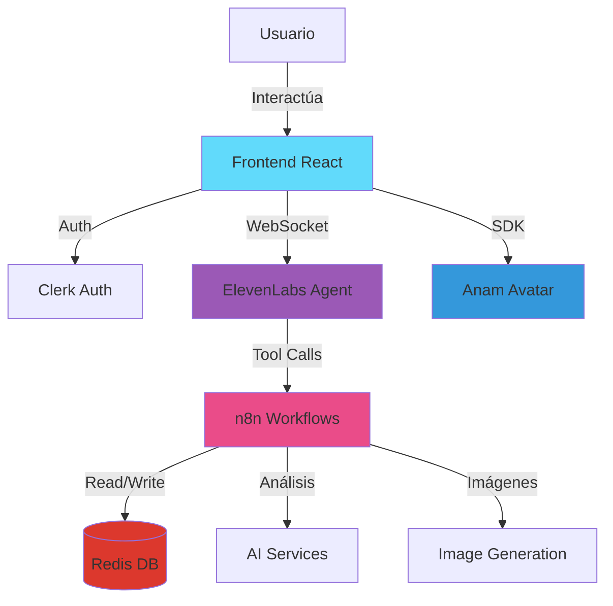
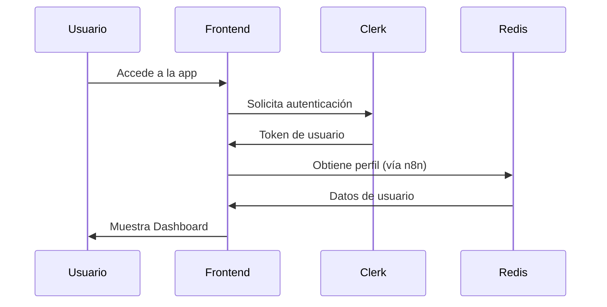
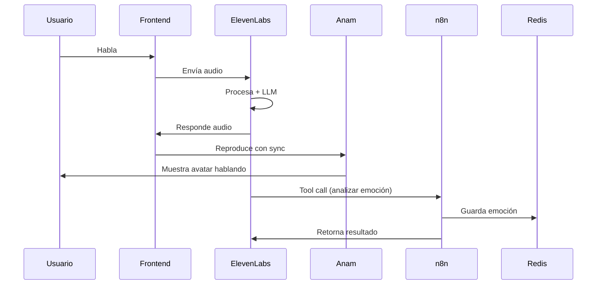
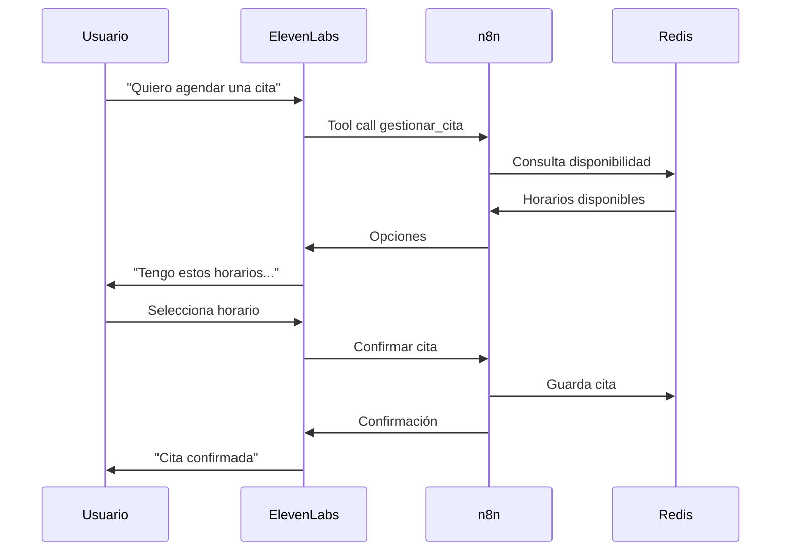

# Arquitectura de Psyness

## Visión General

Psyness es una plataforma de apoyo emocional basada en agentes conversacionales con avatares virtuales y voz natural.

## Stack Tecnológico

### Frontend
- **Framework**: React 18 con Vite
- **Autenticación**: Clerk
- **Routing**: React Router
- **Avatares**: Anam SDK
- **Voz**: ElevenLabs WebSocket API

### Backend
- **Orquestador**: n8n (workflows)
- **Base de Datos**: Redis (in-memory)
- **Webhooks**: n8n hosted webhooks

### AI/ML
- **Conversación**: ElevenLabs Conversational AI
- **Análisis Emocional**: LLM (vía ElevenLabs o custom)
- **Generación de Entornos**: Image generation API

## Diagrama de Arquitectura



## Flujo de Datos

### 1. Inicio de Sesión



### 2. Conversación Activa



### 3. Gestión de Citas



## Componentes Principales

### Frontend

```
src/
├── pages/
│   ├── Landing.jsx          # Página inicial
│   ├── Dashboard.jsx        # Selector de persona
│   ├── Session.jsx          # Sesión activa
│   └── NotFound.jsx         # 404
├── components/
│   ├── AvatarContainer.jsx  # Contenedor Anam
│   └── Controls.jsx         # Controles de sesión
├── hooks/
│   └── useAnam.js           # Hook para Anam SDK
├── config/
│   └── personas.js          # Config de personas
└── routes.jsx               # Rutas de la app
```

### Backend (n8n)

```
workflows/
├── gestionar_cita.json      # CRUD de citas
├── evaluar_tono_emocional.json  # Análisis emocional
└── generar_entorno.json     # Generación de backgrounds
```

### Base de Datos (Redis)

```
Keys:
├── doctor:{persona}         # Info de personas
├── usuario:{id}:*           # Datos de usuario
├── sesion:{id}              # Sesión activa
├── emociones:{userId}       # Historial emocional
├── entorno:{tipo}           # Cache de entornos
└── citas:{userId}           # Citas programadas
```

## Seguridad

### Autenticación
- Clerk maneja auth completa
- JWT tokens para API calls
- Protected routes en frontend

### API Keys
- Nunca expuestas en cliente
- Variables de entorno
- Rotation periódica

### Data Privacy
- Datos sensibles en Redis con TTL
- No logging de conversaciones privadas
- GDPR compliance

## Escalabilidad

### Limitaciones Actuales
- Redis single instance (in-memory)
- n8n self-hosted
- No load balancing

### Mejoras Futuras
- Redis Cluster
- n8n cloud o multi-instance
- CDN para assets
- Microservicios

## Monitoreo

### Métricas Clave
- Latencia de WebSocket (ElevenLabs)
- FPS del avatar (Anam)
- Tiempo de respuesta workflows (n8n)
- Hit rate de Redis cache

### Logging
- Frontend: Console + analytics
- Backend: n8n execution logs
- Redis: Slow queries

## TODO

- [ ] Implementar health checks
- [ ] Añadir service workers para offline
- [ ] Configurar CDN
- [ ] Implementar rate limiting
- [ ] Añadir analytics detallados
- [ ] Configurar CI/CD
- [ ] Documentar disaster recovery
